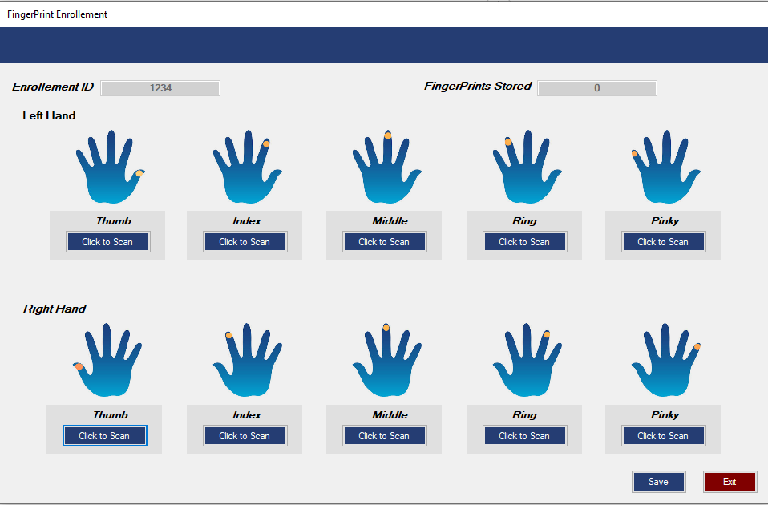
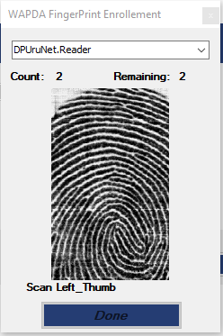

```markdown
## Biometric Fingerprint Scanner Application
This project is a .NET wrapper and a desktop application that utilizes the U.are.U SDK to interact with fingerprint scanners. The application facilitates the scanning of fingerprints, generating XML Fingerprint Identification (FID) records, and cross-matching fingerprint datasets using Crossmatch technology.

## Features

1. Fingerprint Scanning: The application interfaces with fingerprint scanners to capture fingerprint images.
2. XML Fingerprint Identification (FID): Generates XML files containing FID records for each scanned fingerprint.
3. Image Capture: Captures images of fingerprints and converts them into Base64 format for transfer processes.
4.  Crossmatching: Utilizes the Crossmatch technology to compare captured fingerprints with stored datasets.


## Installation

1. Clone the repository to your local machine.
2. Open the solution file (BiometricApp.sln) in Visual Studio.
3. Build the solution to resolve dependencies.
4. Run the application.

## Usage

1. Connect the fingerprint scanner to your computer.
2. Launch the application.
3. Follow the on-screen instructions to scan fingerprints.
4. View captured fingerprint images and XML FID records.
5. Perform cross-matching of fingerprints with stored datasets.


## Screenshots



## Requirements

2. .NET Framework 4.5 or higher
1. U.are.U SDK


## Dependencies

 The project uses NuGet packages for MySQL, MySQL Data, and MySQL Client for connecting with MySQL databases, such as XAMPP and Laragon. And FInally the provided U are U SDK.

## Installation

 Please ensure that you have .NET 4.5, Provided SDK and MySQL installed on your machine. Then, clone this repository and install the necessary NuGet packages.

## Contributing

 Pull requests are welcome. For major changes, please open an issue first to discuss what you would like to change.

## License

[MIT]
